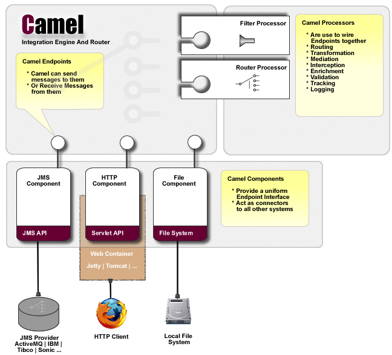
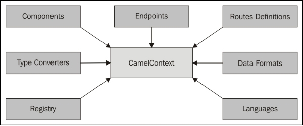
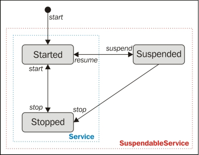
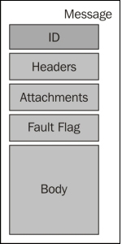
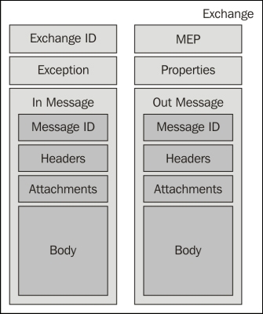

# Apache Camel

## Table of Content

- [Overview](#Overview)
- [History](#History)
- [Modules](#Modules)
- [Appendix](#Appendix)

## Overview

- In an enterprise, we see a lot of different software and systems in the IT ecosystem. To provide a complete business solution, software systems has to exchange data.
- This communication or integration is not so easy, as we have to deal with the specifications on each system like protocols, message data format etc.. These are different in most of the time, so we have to transform and adapt to each system.
- To solve this problem, there are two options to do these integrations
  - **Point-to-point communication**:
    - In this approach, we write a pointed integration between two systems.
    - The problem with this approach is that we tighten the integration of a couple of systems.
    - Changes to any systems or protocols requires refactoring of the implementation.
  - **Mediation**:
    - In this approach, there will be a message system that acts a mediator to send and receive messages between all the programs.
    - Apache Camel is an open source mediation framework that allows you to integrate systems and that comes with a lot of connectors and Enterprise Integration Patterns (EIP) components out of the box. We can also extend and implement custom components.
- Components are categorized into two types:
  - **External**:
    - Expose endpoints for external system or communicate with external systems.
  - **Internal**:
    - Applying validation or transformation rules to the inflight messages that are internally to Camel
- As part of integration we also require rule definition to apply a routing logic to a message. This is done using below:
  - **Expressions**:
    - These return any kind of value.
    - It supports xpath, mvel, ognl, python, ruby, PHP, JavaScript, SpEL (Spring Expression Language), Groovy, and so on as expression languages.
  - **Predicates**:
    - These return true or false only.
- Camel supports different data formats, in a pluggable way by marshall or unmarshall a message in a given format. Camel looks for a type converter, allowing to implicitly transform a message from one format to another. We can also explicitly define the type converter of requirement choice at some points during the processing of the message.

---

## History

---

## Modules

- Below are the core components of Apache Camel

  - Below is the Architecture overview of Apache Camel. Individual details are provided below.

    

  - Camel context

    - The Camel context is the runtime system that loads containers of all resources required for the execution of the routing.
    - When the context starts, it also starts various components and endpoints, and activates the routing rules.
    - The Camel context is described by the `org.apache.camel.CamelContext` interface
      

    - Camel Context has its own life cycle
      - Start: Loads all the resources needed and activating the routing logic.
      - Stopped: Its a cold stop i.e. all the resources loaded are stopped.
      - Suspended: It stops the routing of the messages but keeps all the resources loaded. Suspended context can return to the started state very quickly using resume.
        

  - Message

    - Messages transport the data between the different parts of the mediation logic.
    - A message flows in one direction, from a sender to a receiver. It's not possible to use the same message to answer the sender, we will have to use another message.
    - A message is described in the `org.apache.camel.Message` interface.
    - A message contains the following

      | Identifier | Description                                                                                                                                                                                                                                                                                                                                                          |
      | :--------- | :------------------------------------------------------------------------------------------------------------------------------------------------------------------------------------------------------------------------------------------------------------------------------------------------------------------------------------------------------------------- |
      | ID         | It is of a String type. Its is used to identify each message.                                                                                                                                                                                                                                                                                                        |
      | Header     | Used to store any kind of data associated with a message. The data is stored in `CaseInsensitiveMap`. This can store any kinds of object and can use use a String key, which is case insensitive.                                                                                                                                                                    |
      | Attachment | Used to store attachments that are used by some protocols and components like e-mail component, WebService component. The attachments are stored in the message as `Map<String,DataHandler>`. An attachment name is a String, which is case sensitive. An attachment is stored using `DataHandler` providing support of MIME type and consistent access to the data. |
      | Fault flag | This flag is used to indicate if the message is normal message or a faulted message.                                                                                                                                                                                                                                                                                 |
      | Body       | The body is the actual payload of the message. The body is stored as an `Object` in the message, allowing you to store any kind of data.                                                                                                                                                                                                                             |

      

- Exchange

  - Camel doesn't transport a message directly. Camel wraps the messages into an **Exchange object** that acts as a messages container with all meta-data required for the routing logic.
  - Camel uses Exchange object that encapsulates messages and Message Exchange Patterns (MEP). Camel supports the below MEP's. MEP are described in the `org.apache.camel.ExchangePattern` enumeration
    - InOnly
    - InOptionalOut
    - InOut
    - OutIn
    - OutOptionalIn
    - RobustInOnly
    - RobustOutOnly
  - A message can only flows in only one direction, in order to support the different MEPs, we need two messages. Both are wrapped using **Exchange object**
    - The first message is mandatory as it's the in message.
    - The second message is optional (depending on the MEP) as it's the out message
  - An **Exchange object** contains the following. The `org.apache.camel.Exchange` interface describes an exchange.

    | Identifier  | Description                                                                                                                                                                                                                           |
    | :---------- | :------------------------------------------------------------------------------------------------------------------------------------------------------------------------------------------------------------------------------------ |
    | Exchange ID | This is a unique identifier for the exchange. This is a String datatype.                                                                                                                                                              |
    | MEP         | Message Exchange Pattern                                                                                                                                                                                                              |
    | Exception   | It stores the current cause of an exchange failure.                                                                                                                                                                                   |
    | Properties  | The properties is a `Map<String, Object>` and may look like message headers. The main difference is their lifetime: the properties exist during the whole exchange execution, whereas the headers are limited to the message duration |
    | In Message  | It is a mandatory message and is always set.                                                                                                                                                                                          |
    | Out Message | It is a optional message and is only used with InOutMEP.                                                                                                                                                                              |

    

- Processor

  - A processor is a node in the routing which is able to use, create, or modify an incoming exchange.
  - Enterprise Integration Patterns (EIP) are implemented using processors in Camel.
  - A processor is described using the `org.apache.camel.Processor` interface.

- Routes

  - It's a graph of processors or routing definition between the processors.
  - The routing definition are loaded in the Camel context.
  - The execution and flow of the exchange in a route is performed by the **routing engine**.
  - Each route has a unique identifier that you can specify. This identifier is used to easily find the route, especially when you want to log, debug, monitor, or manage a route.
  - A route has a life cycle similar to the Camel context with the same states: started, stopped, and suspended. This life cycle is managed by Camel context.

- Channel

  - It sits between each processor in the route graph. It's responsible for the routing of an Exchange to the next Processor in the graph.
  - The channel acts as a controller that monitors and controls the routing at runtime.
  - The channel is described by the `org.apache.camel.Channel` interface.
  - Channel allows Camel to enrich the route with interceptors. For instance, the Camel tracer or the error handling are functionalities implemented using an interceptor on the channel. There are three types of interceptors
    - **Global interceptors**: This intercepts all exchanges on the channels.
    - **Interceptors on the incoming exchanges**: This has limited the scope of the interceptor only on the first channel i.e. the one just after the first endpoint.
    - **Interceptors on the exchanges going to one specific endpoint**: This limits the interceptor to the channel just before a given endpoint.

- Domain Specific Languages

  - Domain Specific Languages(DSL) is used to wire processors and endpoints together to define and form routes.
  - Camel will load and interpret the DSL to create and instantiate all the objects.
  - DSL is language agnostic and supports different programing languages like Java, Spring XML, REST, Groovy and Scala.

- Components:

  - Components are used to define endpoints. These are the main extension points in Camel.
  - Camel provides about 100 components and allows us to create our own components.
  - The endpoints are described using a URI. At runtime, Camel looks for the URI and check component defined in prefix is loaded into Camel context and use this component to actually create the endpoint.

- Registry:

  - Camel will use registry to look for the beans used in the routing.
  - Camel supports a pluggable Registry plugin strategy. This allows Camel to easily work with some kind of registry.
  - The following registry implementations are shipped with Camel
    - **SimpleRegistry**: It's basically a simple Map. It is mostly used for testing where only a limited number of JDK classes are available.
    - **JndiRegistry**: It's the default registry used by Camel when using the Camel Java DSL. It is an implementation that uses an existing Java Naming and Directory (JNDI) registry to look up beans.
    - **ApplicationContextRegistry**: It is a Spring-based implementation to look up beans from the Spring ApplicationContext.
    - **OsgiServiceRegistry**: It is a OSGi based implementation to look up beans from the OSGi Service Registry.
    - **CompositeRegistry**: Used to create multilayer registry.

- Formatting

  - Camel supports a pluggable data format allowing you to marshall and unmarshall the messages.

---

## Appendix
